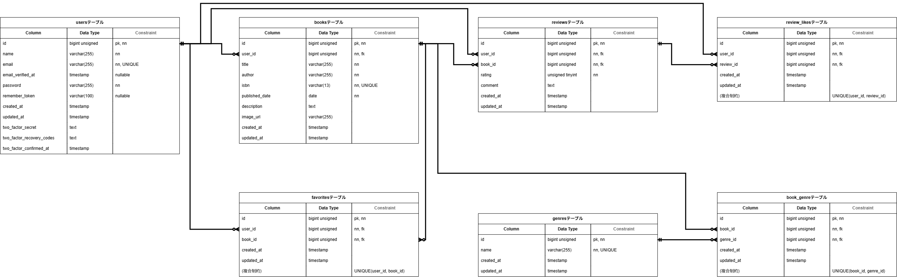

# BookShelf 書籍レビューアプリ

## 概要

書籍の登録・編集・削除、レビュー投稿、お気に入り登録、レビューへのいいね、ジャンル管理、ランキング表示などの機能を実装した書籍レビューアプリです。

一般ユーザーは書籍の一覧・詳細を閲覧でき、ログイン後は書籍の登録・編集・削除、レビューの投稿・編集・削除、お気に入り登録、レビューへのいいねなどを利用できます。

また、外部アプリケーションから利用できる公開APIを実装しています。

## 作成者

芹川 綾美

## 使用技術

- PHP 8.5
- Laravel 10.x
- MySQL 8.4
- Docker
- Docker Compose
- Laravel Sail
- phpMyAdmin
- Vite
- Tailwind CSS ^3.4.0
- @tailwindcss/forms
- Laravel Fortify
- Laravel Sanctum

## ER図



## 開発環境URL

http://localhost

phpMyAdmin：

http://localhost:8080

## 動作環境

- Docker
- Docker Compose
- Laravel Sail

Windows環境ではWSL2を利用してDocker Desktopを使用してください。

## 環境構築手順

### 1. リポジトリをクローン

以下のコマンドを実行して、リポジトリをクローンします。

```bash
git clone https://github.com/serikawa-ayami/bookshelf-app.git
cd bookshelf-app
```

### 2. `.env`ファイルを作成

`.env.example`をコピーして`.env`を作成します。

```bash
cp .env.example .env
```

`.env`のデータベース接続情報を以下のように設定します。

```ini
DB_CONNECTION=mysql
DB_HOST=mysql
DB_PORT=3306
DB_DATABASE=laravel
DB_USERNAME=sail
DB_PASSWORD=password
```

### 3. Composer依存パッケージをインストール

初回セットアップ時は`vendor`ディレクトリが存在しないため、まだSailコマンドを使用できません。

Docker上のComposerを使用して依存パッケージをインストールします。

```bash
docker run --rm \
    -u "$(id -u):$(id -g)" \
    -v "$(pwd):/var/www/html" \
    -w /var/www/html \
    laravelsail/php82-composer:latest \
    composer install --ignore-platform-reqs
```

`vendor`ディレクトリが作成されたことを確認します。

### 4. Laravel Sailの起動

以下のコマンドでDockerコンテナを起動します。

```bash
./vendor/bin/sail up -d
```

sailコマンドを使用できるようにエイリアスを設定します。

使用しているシェルの設定ファイルに追記してください（シェルは`echo $SHELL`で確認できます）。

bashの場合：

```bash
echo "alias sail='[ -f sail ] && bash sail || bash vendor/bin/sail'" >> ~/.bashrc
```

zshの場合：

```bash
echo "alias sail='[ -f sail ] && bash sail || bash vendor/bin/sail'" >> ~/.zshrc
```

※ 実行するたびに同じ行が追記されるため、1回だけ実行してください。

シェルを再起動してエイリアスを有効にします。

```bash
exec $SHELL
```

以降の手順では`sail`コマンドを使用します。

### 5. アプリケーションキーを生成

以下のコマンドを実行します。

```bash
sail artisan key:generate
```

### 6. データベースのマイグレーションと初期データ投入

以下のコマンドでテーブルを作成し、Seederによる初期データを投入します。

```bash
sail artisan migrate --seed
```

データベースを初期状態から作り直す場合は、以下を実行します。

```bash
sail artisan migrate:fresh --seed
```

データベース接続エラーなどが発生し、既存のMySQLコンテナやデータボリュームが原因と考えられる場合は、以下を順番に実行してください。

```bash
sail down -v
sail up -d
sail artisan migrate:fresh --seed
```

`-v`を付けた`down`は、Dockerボリュームも削除してデータベースを初期化します。

### 7. フロントエンドの依存パッケージをインストール

以下のコマンドを実行します。

```bash
sail npm install
```

### 8. Viteを起動

以下のコマンドを実行します。

```bash
sail npm run dev
```

### 9. アプリケーションにアクセス

ブラウザで以下のURLにアクセスします。

http://localhost

phpMyAdminを使用する場合は、以下のURLにアクセスします。

http://localhost:8080

## テスト実行

テストを実行する場合は、以下のコマンドを使用します。

    sail artisan test

カバレッジ付きで実行する場合は、以下のコマンドを使用します。

    sail artisan test --coverage

## 機能一覧

### 認証機能

- ユーザー登録
- ログイン・ログアウト
- 認証・未認証ユーザーに応じたアクセス制御

### 書籍機能

- 書籍一覧表示
- 書籍詳細表示
- 書籍登録・編集・削除
- キーワード検索
- ジャンルによる絞り込み
- 登録日・タイトル・評価による並び替え
- ページネーション

### レビュー機能

- レビュー投稿
- レビュー編集・削除
- レビュー評価・コメントの管理

### お気に入り機能

- 書籍のお気に入り登録・解除
- お気に入り書籍一覧表示

### いいね機能

- レビューへのいいね・解除
- レビューごとのいいね数表示

### ジャンル管理機能

- ジャンル一覧表示
- ジャンル詳細表示
- ジャンル登録・編集・削除
- ジャンルごとの書籍数表示

### ランキング機能

- レビュー平均評価による書籍ランキング表示

### 公開API

- 書籍一覧取得
- 書籍詳細取得
- 書籍登録
- 書籍更新
- 書籍削除
- 書籍一覧の検索・絞り込み・ページネーション

## APIエンドポイント一覧

公開APIは`/api/v1`配下に定義しています。

| HTTPメソッド | URI                    | 概要           |
| ------------ | ---------------------- | -------------- |
| GET          | `/api/v1/books`        | 書籍一覧を取得 |
| GET          | `/api/v1/books/{book}` | 書籍詳細を取得 |
| POST         | `/api/v1/books`        | 書籍を登録     |
| PUT          | `/api/v1/books/{book}` | 書籍を更新     |
| DELETE       | `/api/v1/books/{book}` | 書籍を削除     |
